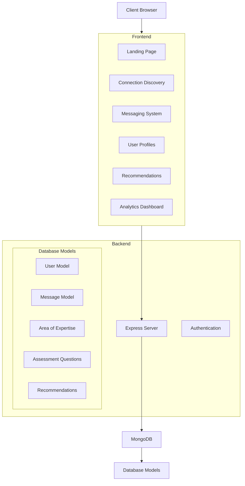

# GuideX

### Empowering Growth Through Meaningful Connections

[](https://reactjs.org/)
[](https://tailwindcss.com/)
[](https://nodejs.org/)
[](https://www.mongodb.com/)

## Vision

GuideX bridges the gap between those seeking guidance and those offering expertise. Our platform fosters a community where meaningful connections drive personal and professional growth through a gamified journey of achievement and recognition.

## Core Features

- **Smart Matching**: AI-powered algorithm connects users based on complementary skills, goals, and learning styles
- **Interactive Communication**: Real-time messaging with context-aware suggestions to enhance meaningful conversations
- **Growth Analytics**: Comprehensive insights to track personal development and connection impact
- **Achievement System**: Progressive tiers from Bronze to Diamond that reward engagement and community contribution

## Technology Ecosystem

### Frontend
- **React with Vite**: Fast, modern UI development
- **Tailwind CSS**: Responsive design without leaving your HTML
- **Lucide Icons**: Beautiful, consistent iconography
- **3D Visualization**: Interactive grid for enhanced user experience

### Backend
- **Node.js & Express**: Robust API foundation
- **MongoDB**: Flexible document-based storage
- **JWT Authentication**: Secure user sessions
- **RESTful Architecture**: Clean, standardized endpoints

## Project Architecture



## Getting Started

### Prerequisites
- Node.js (v14+)
- npm or yarn
- MongoDB

### Quick Start

```bash
# Clone repository
git clone https://github.com/yourusername/FusionFestHack-GuideX-Project.git
cd FusionFestHack-GuideX-Project

# Backend setup
cd backend
npm install
# Set up .env with your MongoDB URI
npm run dev

# Frontend setup (in a new terminal)
cd frontend
npm install
npm run dev

# Open http://localhost:5173 in your browser
```

## Growth Journey Tiers

| Tier | Requirements | Benefits |
|------|--------------|----------|
| **Bronze** | 0-5 connections | Basic profile, Community access |
| **Silver** | 5-20 connections | Silver badge, Enhanced matching |
| **Gold** | 20-50 connections | Verified badge, Priority features |
| **Diamond** | 50+ connections | Elite perks, Custom features |

## Contributing

We welcome contributions from the community! To contribute:

1. Fork the repository
2. Create your feature branch (`git checkout -b feature/amazing-feature`)
3. Commit your changes (`git commit -m 'Add some amazing feature'`)
4. Push to the branch (`git push origin feature/amazing-feature`)
5. Open a Pull Request

See our [Contributing Guidelines](CONTRIBUTING.md) for more details.

## License

This project is licensed under the MIT License - see the [LICENSE](LICENSE) file for details.

## Acknowledgements

- [React](https://reactjs.org/)
- [Tailwind CSS](https://tailwindcss.com/)
- [Lucide Icons](https://lucide.dev/)
- [Express.js](https://expressjs.com/)
- [MongoDB](https://www.mongodb.com/)

---

© 2025 GuideX. All rights reserved.

*Empowering growth through meaningful connections*